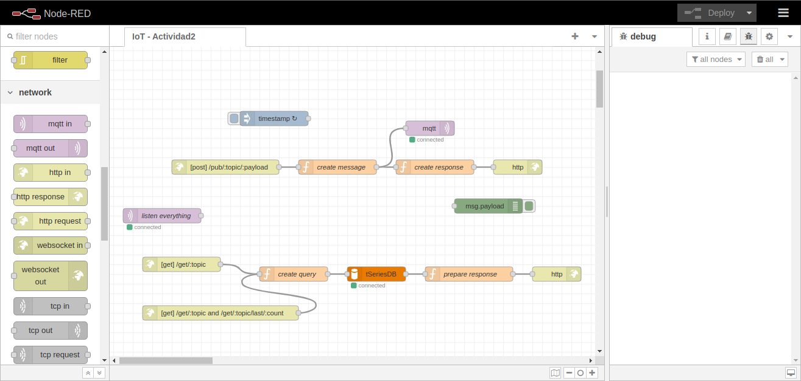
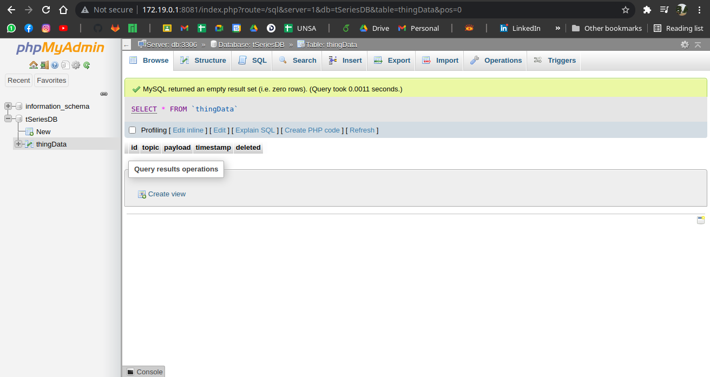

## Instalación de Docker y Docker-Compose en Distribuciones basadas en Arch-Linux

Para instalar docker sigue los siguientes paso: 
1. sudo pacman -S docker
Otorgar permisos de lectura y escritura:
1. sudo chmod 666 /var/run/docker.sock
Instalación de Docker-compose:
1. sudo curl -L "https://github.com/docker/compose/releases/download/1.26.0/docker-compose-$(uname -s)-$(uname -m)"  -o /usr/local/bin/docker-compose
2. sudo mv /usr/local/bin/docker-compose /usr/bin/docker-compose
3. sudo chmod +x /usr/bin/docker-compose

## Clonación del proyecto e inicio de Docker

Para clonar este proyecto:
1. git clone https://github.com/senior-gato/IoT-Actividad2.git
Iniciar Docker: 
1. systemctl start docker
Ejecución de docker-compose
1. cd /IoT-Actividad2
2. docker-compose up

## Screenshots

|     |     |
| :-: | :-: |
|  Node-RED | PHP MyAdmin |
|     |      |
